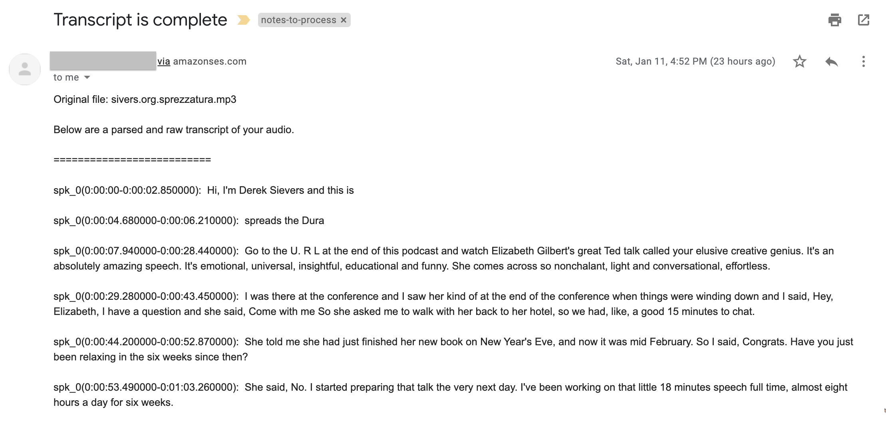

# serverless-transcribe

A simple web UI for [Amazon Transcribe](https://aws.amazon.com/transcribe/). Supports MP3, MP4, WAV, and FLAC audio without any fixed costs.

## How it Works

Once the project has been launched in [CloudFormation](https://aws.amazon.com/cloudformation/), you will have access to a webpage that allows users to upload audio files. 

The page submits the information about the podcast to an API endpoint backed by a Lambda function that takes the URL of the podcast, downloads and then uploads it to an [S3](https://aws.amazon.com/s3/) bucket. The S3 bucket is configured to watch for audio files. When it sees new audio files, an [AWS Lambda](https://aws.amazon.com/lambda/) function is invoked, which starts a transcription job.

File detection is based on the file extension. Supported extensions are: `.mp3`, `.mp4`, `.m4a`, `.wav`, and `.flac`.

Another Lambda function is triggered via [CloudWatch Events](https://docs.aws.amazon.com/AmazonCloudWatch/latest/events/WhatIsCloudWatchEvents.html) when the transcription job completes (or fails). An email is sent to the user who uploaded file with details about the job failure, or a raw transcript that is extracted from the job results.

The webpage and the API endpoint the form is submitted to are protected by HTTP Basic authentication, with a single set of credentials that you set when launching the stack. This is handled by an authorizer on the [API Gateway](https://aws.amazon.com/api-gateway/), and could be extended to allow for more robust authorization schemes.

Amazon Transcribe currently has file limits of 4 hours and 2 Gb.

### AWS Costs

The cost of running and using this project are almost entirely based on usage. Media files uploaded to S3 are set to expire after one day, and the resulting files in the transcripts bucket expire after 30 days. The Lambda functions have no fixed costs, so you will only be charged when they are invoked. Amazon Transcribe is "[pay-as-you-go](https://aws.amazon.com/transcribe/pricing/) based on the seconds of audio transcribed per month".

Most resources created from the CloudFormation template include a `Project` resource tag, which you can use for cost allocation. Unfortunately Amazon Transcribe jobs cannot be tracked this way.

## How to Use

The project is organized using a [SAM](https://aws.amazon.com/serverless/sam/) CloudFormation [template](https://github.com/farski/serverless-transcribe/blob/master/template.yaml). Launching a stack from this template will create all the resources necessary for the system to work.

### Requirements

- The stack must be launched in an AWS region that supports [SES](https://aws.amazon.com/ses/). There aren't [many of these](https://docs.aws.amazon.com/general/latest/gr/rande.html#ses_region), unfortunately. The addresses that SES will send to and from are determined by your SES domain verification and sandboxing status.

### Using the SAM CLI to deploy

Deploying using the  [AWS SAM CLI](https://github.com/awslabs/aws-sam-cli) is the simplest option. Once the CLI is [installed](https://docs.aws.amazon.com/serverless-application-model/latest/developerguide/serverless-sam-cli-install.html), you can run `sam deploy --guided` in the project directory to deploy the application. (After the first deploy, you can use `sam deploy` if `samconfig.toml` is present in the directory.)

Any other deployment method that is compatible with SAM templates would also work.

_Note: The deploy script that was previously included in the project is no longer supported._
